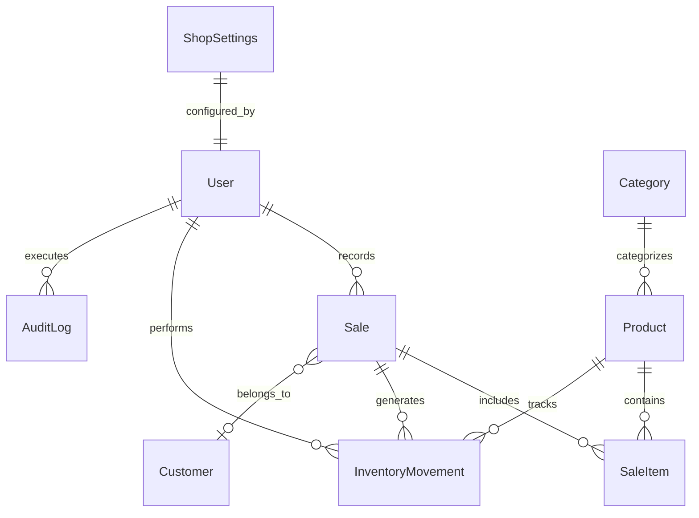
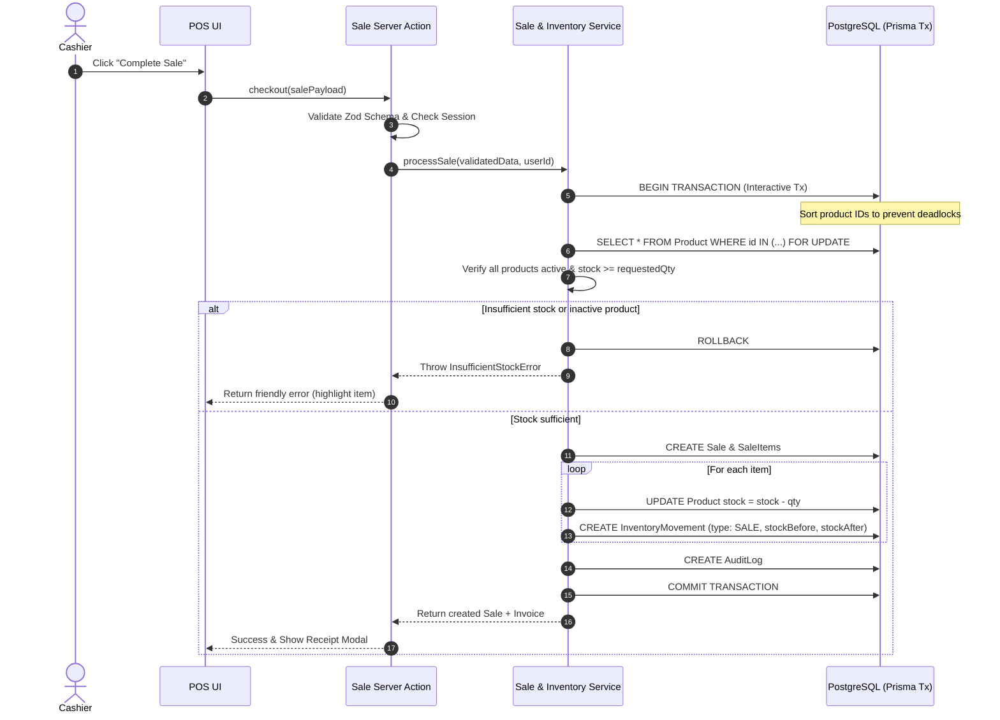

# Retail Shop Management System - Architecture & Technical Specification

## 1. Project Overview & Context

* **Project State**: Greenfield project (directory is currently empty).
* **Application Scope**: Production-quality, single-store (with multi-store/multi-tenant extensibility) Retail Shop Management system handling Inventory, POS/Sales recording, Audit Logging, Reporting, Analytics, and Shop Administration.
* **Core Philosophy**: Absolute data integrity, strict decimal-safe financial math, auditable double-entry-style inventory movements, zero negative stock, modular domain isolation, and clean UI/UX using Next.js App Router with Server Components and shadcn/ui.

---

## 2. Technology Stack & Decision Rationale

| Layer / Concern | Technology | Selection Rationale |
| :--- | :--- | :--- |
| **Framework** | Next.js 14/15 (App Router) | High performance via React Server Components (RSC), seamless streaming, co-located Route Handlers and Server Actions. |
| **Language** | TypeScript (Strict Mode) | End-to-end type safety, strict null checking, shared types between API/Actions and UI. |
| **Styling & UI** | Tailwind CSS + shadcn/ui (Radix Primitives) | Accessible, customizable, unstyled core primitives with clean, modern Tailwind styling. No heavy component library locks. |
| **Database & ORM** | PostgreSQL + Prisma ORM | ACID-compliant relational DB with strong concurrency primitives (`FOR UPDATE`, check constraints). Prisma provides type-safe migrations and client generation. |
| **Authentication** | Auth.js (NextAuth v5) / Iron Session / Jose JWT | Session-cookie based authentication compatible with RSC, Server Actions, and Middleware. Role-based session tokens. |
| **Validation** | Zod | Runtime validation for forms, Server Actions, API routes, and environment variables. |
| **Math Precision** | `decimal.js` / `Prisma.Decimal` | Guarantees zero floating-point arithmetic errors for currency, tax, discounts, and margins. |
| **Data Visualization**| Recharts / Lucide Icons | Responsive SVG charts for revenue trends, category breakdown, inventory turnover, and sales velocity. |
| **Export Engine** | `csv-stringify` / native streaming Route Handlers | Streamed CSV generation without memory spikes on large date ranges. |

---

## 3. Proposed Folder Structure (Modular Monolith)

The codebase is organized by architectural layers with clear domain boundaries. Business logic is strictly prohibited from living inside UI components.

```
InventoryShopManagement/
├── .env.example
├── .gitignore
├── package.json
├── tsconfig.json
├── next.config.mjs
├── tailwind.config.ts
├── postcss.config.mjs
├── components.json              # shadcn/ui configuration
├── prisma/
│   ├── schema.prisma            # Prisma schema definition
│   ├── migrations/              # Database migration history
│   └── seed.ts                  # Seed script (default admin, categories, demo products)
├── public/                      # Static assets
└── src/
    ├── app/                     # Next.js App Router (Routing & Presentation)
    │   ├── (auth)/              # Route group: Authentication
    │   │   ├── login/
    │   │   │   └── page.tsx
    │   │   └── layout.tsx
    │   ├── (dashboard)/         # Route group: Authenticated layout
    │   │   ├── layout.tsx       # Sidebar, Topbar, Global alerts & User menu
    │   │   ├── page.tsx         # Dashboard / Analytics home
    │   │   ├── pos/             # Point of Sale interface
    │   │   │   └── page.tsx
    │   │   ├── products/        # Product catalog & category management
    │   │   │   ├── page.tsx
    │   │   │   ├── new/page.tsx
    │   │   │   └── [id]/page.tsx
    │   │   ├── inventory/       # Stock tracking, manual adjustments, movements
    │   │   │   ├── page.tsx
    │   │   │   └── movements/page.tsx
    │   │   ├── sales/           # Sales history & sale inspection/reversal
    │   │   │   ├── page.tsx
    │   │   │   └── [id]/page.tsx
    │   │   ├── customers/       # Optional customer registry
    │   │   │   └── page.tsx
    │   │   ├── reports/         # Detailed report builder & CSV export
    │   │   │   └── page.tsx
    │   │   └── settings/        # Shop settings, tax rates, profile
    │   │       └── page.tsx
    │   ├── api/                 # Route Handlers (REST endpoints)
    │   │   ├── auth/[...nextauth]/route.ts
    │   │   └── reports/export-csv/route.ts
    │   └── layout.tsx           # Root layout (Theme, Providers, Toaster)
    │
    ├── components/              # UI Components
    │   ├── ui/                  # Reusable shadcn primitives (Button, Dialog, Table, etc.)
    │   ├── layout/              # Sidebar, Header, Breadcrumbs, MobileNav
    │   ├── dashboard/           # Metrics cards, SalesChart, LowStockAlerts
    │   ├── pos/                 # ProductPicker, CartSummary, CheckoutModal, BarcodeScanner
    │   ├── products/            # ProductTable, ProductForm, CategoryModal
    │   ├── inventory/           # StockAdjustmentModal, MovementHistoryTable
    │   ├── sales/               # SalesTable, SaleReceiptModal, SaleCancelDialog
    │   └── shared/              # DateRangeFilter, CurrencyDisplay, ConfirmDialog, StatusBadge
    │
    ├── server/                  # Backend Domain & Core Services (Isolated from UI)
    │   ├── actions/             # Next.js Server Actions (Controllers / Entry points)
    │   │   ├── auth.actions.ts
    │   │   ├── product.actions.ts
    │   │   ├── inventory.actions.ts
    │   │   ├── sale.actions.ts
    │   │   └── settings.actions.ts
    │   ├── services/            # Domain Services (Business Logic)
    │   │   ├── inventory.service.ts   # Centralized Stock Mutation Engine
    │   │   ├── sale.service.ts        # Atomic Checkout & Sale Reversal
    │   │   ├── product.service.ts     # Catalog & Category Rules
    │   │   ├── report.service.ts      # Aggregations, COGS, Profit Margins
    │   │   └── audit.service.ts       # Centralized Activity Logging
    │   ├── db/                  # Database connectivity & client
    │   │   └── prisma.ts        # Singleton PrismaClient instance
    │   └── security/            # Auth session extraction & RBAC verification
    │       ├── auth.ts          # Auth config
    │       ├── session.ts       # Get current user session helper
    │       └── permissions.ts   # Role-based policy checks (canManageStock, canRefund, etc.)
    │
    ├── lib/                     # Utilities & Cross-cutting Helpers
    │   ├── decimal.ts           # Safe decimal math helpers (add, multiply, round)
    │   ├── dates.ts             # Date range utilities (Today, Yesterday, This Month, etc.)
    │   ├── utils.ts             # cn() Tailwind helper, formatting functions
    │   └── errors.ts            # Domain error classes & action response wrappers
    │
    └── types/                   # Shared Schemas & Interfaces
        ├── schemas/             # Zod schemas (product.schema.ts, sale.schema.ts, etc.)
        └── index.ts             # Common TypeScript definitions
```

---

## 4. Entity Relationship Design & Data Modeling

### 4.1 ER Diagram Concept



### 4.2 Key Architectural Tenets in Data Design
1. **Double-Entry Style Inventory Movements**: `Product.stock` is a cached denormalized balance. Every single unit change MUST be backed by an immutable row in `InventoryMovement`.
2. **Snapshotting in Line Items**: `SaleItem` records the unit cost price (`costPrice`) and unit selling price (`unitPrice`) at the exact millisecond of checkout. Changes in catalog product pricing will NEVER corrupt historical financial margins or COGS (Cost of Goods Sold).
3. **Decimals for Money**: Stored as `Decimal(12, 2)` (or `Decimal(14, 4)` for fractional quantity/unit costs). Never float or integer-in-cents without strict conversion helpers.
4. **Soft Deactivation**: Products and categories have `isActive Boolean @default(true)` and `deletedAt DateTime?`. This ensures historical sales receipts never throw foreign key or missing relation errors.

---

## 5. Proposed Prisma Schema

```prisma
datasource db {
  provider = "postgresql"
  url      = env("DATABASE_URL")
}

generator client {
  provider = "prisma-client-js"
}

enum Role {
  ADMIN
  MANAGER
  CASHIER
}

enum MovementType {
  PURCHASE           // Stock in from supplier/vendor
  SALE               // Stock deducted via checkout
  SALE_REVERSAL      // Stock restored from cancelled/refunded sale
  MANUAL_ADJUSTMENT  // Physical inventory count correction / shrinkage
  RETURN             // Customer return (stocked back)
  RETURN_REVERSAL    // Return cancellation
}

enum SaleStatus {
  COMPLETED
  CANCELLED
  PARTIALLY_REFUNDED
}

enum PaymentMethod {
  CASH
  CARD
  UPI_QR
  BANK_TRANSFER
  STORE_CREDIT
  OTHER
}

model User {
  id            String              @id @default(cuid())
  name          String
  email         String              @unique
  passwordHash  String
  role          Role                @default(CASHIER)
  isActive      Boolean             @default(true)
  createdAt     DateTime            @default(now())
  updatedAt     DateTime            @updatedAt

  sales         Sale[]
  movements     InventoryMovement[]
  auditLogs     AuditLog[]

  @@index([email])
}

model Category {
  id          String    @id @default(cuid())
  name        String    @unique
  description String?
  isActive    Boolean   @default(true)
  createdAt   DateTime  @default(now())
  updatedAt   DateTime  @updatedAt

  products    Product[]

  @@index([name])
  @@index([isActive])
}

model Product {
  id              String              @id @default(cuid())
  sku             String              @unique
  barcode         String?             @unique
  name            String
  description     String?
  categoryId      String?
  category        Category?           @relation(fields: [categoryId], references: [id], onDelete: SetNull)

  // Financial values
  costPrice       Decimal             @db.Decimal(12, 2) // Wholesale / acquisition cost
  sellingPrice    Decimal             @db.Decimal(12, 2) // Retail price

  // Stock tracking
  stock           Int                 @default(0)        // Cached balance; enforced >= 0
  minStockAlert   Int                 @default(5)        // Low-stock alert threshold

  isActive        Boolean             @default(true)
  createdAt       DateTime            @default(now())
  updatedAt       DateTime            @updatedAt
  deletedAt       DateTime?

  saleItems       SaleItem[]
  movements       InventoryMovement[]

  @@index([sku])
  @@index([barcode])
  @@index([categoryId])
  @@index([isActive])
  @@index([stock])
}

model Customer {
  id          String    @id @default(cuid())
  name        String
  phone       String?   @unique
  email       String?
  address     String?
  notes       String?
  createdAt   DateTime  @default(now())
  updatedAt   DateTime  @updatedAt

  sales       Sale[]

  @@index([phone])
  @@index([name])
}

model Sale {
  id              String              @id @default(cuid())
  invoiceNumber   String              @unique // Sequential e.g. INV-2026-0001
  userId          String              // Cashier/staff who made the sale
  user            User                @relation(fields: [userId], references: [id])
  customerId      String?
  customer        Customer?           @relation(fields: [customerId], references: [id], onDelete: SetNull)

  subtotal        Decimal             @db.Decimal(12, 2)
  taxAmount       Decimal             @default(0.00) @db.Decimal(12, 2)
  discountAmount  Decimal             @default(0.00) @db.Decimal(12, 2)
  grandTotal      Decimal             @db.Decimal(12, 2)

  paymentMethod   PaymentMethod       @default(CASH)
  status          SaleStatus          @default(COMPLETED)

  notes           String?
  cancellationReason String?
  cancelledAt     DateTime?
  cancelledById   String?             // User ID who authorized cancellation

  createdAt       DateTime            @default(now())
  updatedAt       DateTime            @updatedAt

  items           SaleItem[]
  movements       InventoryMovement[]

  @@index([invoiceNumber])
  @@index([userId])
  @@index([customerId])
  @@index([createdAt])
  @@index([status])
}

model SaleItem {
  id              String    @id @default(cuid())
  saleId          String
  sale            Sale      @relation(fields: [saleId], references: [id], onDelete: Cascade)
  productId       String
  product         Product   @relation(fields: [productId], references: [id])

  productName     String    // Preserves product name at sale moment
  sku             String    // Preserves SKU at sale moment
  quantity        Int
  costPrice       Decimal   @db.Decimal(12, 2) // Unit cost at checkout (for exact COGS)
  unitPrice       Decimal   @db.Decimal(12, 2) // Unit retail price
  subtotal        Decimal   @db.Decimal(12, 2) // (quantity * unitPrice)

  createdAt       DateTime  @default(now())

  @@index([saleId])
  @@index([productId])
}

model InventoryMovement {
  id              String        @id @default(cuid())
  productId       String
  product         Product       @relation(fields: [productId], references: [id])

  quantityChange  Int           // Signed: positive (+10) or negative (-2)
  stockBefore     Int           // Product stock immediately prior to mutation
  stockAfter      Int           // Product stock immediately following mutation

  type            MovementType
  referenceId     String?       // ID of Sale, PO, or Adjustment
  referenceType   String?       // "SALE", "ADJUSTMENT", "PURCHASE"

  reason          String?       // E.g. "Counter Sale INV-001", "Damaged goods in transit"
  userId          String
  user            User          @relation(fields: [userId], references: [id])

  saleId          String?
  sale            Sale?         @relation(fields: [saleId], references: [id], onDelete: SetNull)

  createdAt       DateTime      @default(now())

  @@index([productId])
  @@index([type])
  @@index([createdAt])
  @@index([referenceId])
}

model AuditLog {
  id          String    @id @default(cuid())
  userId      String?
  user        User?     @relation(fields: [userId], references: [id], onDelete: SetNull)
  action      String    // e.g. "PRODUCT_DEACTIVATED", "SALE_CANCELLED", "STOCK_ADJUSTED"
  entity      String    // e.g. "Product", "Sale", "Inventory"
  entityId    String?
  metadata    Json?     // Diff / payload details
  ipAddress   String?
  createdAt   DateTime  @default(now())

  @@index([action])
  @@index([entity, entityId])
  @@index([createdAt])
}

model ShopSettings {
  id              String    @id @default("default")
  shopName        String    @default("My Retail Shop")
  currencySymbol  String    @default("$")
  currencyCode    String    @default("USD")
  taxRatePercent  Decimal   @default(0.00) @db.Decimal(5, 2)
  invoicePrefix   String    @default("INV")
  receiptFooter   String?   @default("Thank you for your business!")
  lowStockDefault Int       @default(5)
  updatedAt       DateTime  @updatedAt
}
```

---

## 6. Authentication Approach

1. **Protocol / Framework**: NextAuth.js v5 (Auth.js) or standard secure JWT cookie session using `jose` / `argon2` / `bcryptjs`.
2. **Session Storage**: HTTP-Only, Secure, `SameSite=lax` cookie carrying an encrypted JWT payload or database session reference.
3. **Password Security**: Passwords salted and hashed with `argon2` or `bcryptjs` (cost factor >= 12).
4. **Session Extraction in App Router**:
   - In Server Components: `const session = await auth();`
   - In Server Actions: Domain wrapper `requireAuthenticatedUser()` extracts and validates the session before business logic execution.
   - In Middleware: Protects `/dashboard/*`, `/pos/*`, `/settings/*`, redirecting unauthenticated users to `/login`.

---

## 7. Authorization Strategy (RBAC)

Three core hierarchical roles:
* **ADMIN**: Complete system access, user management, audit logs, raw inventory adjustments, shop settings, financial analytics, sales cancellation.
* **MANAGER**: Product catalog management, category editing, purchase orders, inventory corrections, sales cancellation with reason, dashboard analytics.
* **CASHIER**: Access to POS terminal, recording new sales, viewing products & stock levels, viewing sales history. Prohibited from: editing products, manual stock overrides, changing settings, deleting/canceling sales without manager authorization.

**Implementation**:
Granular permission checks executed strictly in the service/action layer via helper guards:
```typescript
export function assertPermission(user: UserSession, permission: Permission) {
  if (!hasPermission(user.role, permission)) {
    throw new UnauthorizedError(`Role '${user.role}' lacks '${permission}'`);
  }
}
```

---

## 8. Service-Layer Architecture & Concurrency Rules

### 8.1 Centralized Service Layer Principle
UI components and Server Actions NEVER call `prisma.product.update({ data: { stock: ... } })` directly. All inventory adjustments MUST route through `InventoryService.recordMovement(...)`.

### 8.2 Safe Atomic Checkout Workflow (`SaleService.createSale`)



### 8.3 Safe Concurrency & Deadlock Prevention
1. **Sorted Product Locks**: When multiple items are bought, item IDs are sorted (`ids.sort()`) before acquiring locks (`FOR UPDATE` or sequential update). This guarantees two cashiers purchasing items A & B in opposite order will never cause a database deadlock.
2. **Conditional DB Guard**: In addition to application-level checks, updates run with an atomic decrement condition:
   ```sql
   UPDATE "Product" SET "stock" = "stock" - $qty WHERE "id" = $id AND "stock" >= $qty;
   ```
   If zero rows are updated, the transaction immediately aborts, preventing race condition over-selling.

### 8.4 Safe Sale Cancellation (`SaleService.cancelSale`)
1. Fetches sale and verifies status is `COMPLETED`.
2. Within an atomic transaction:
   - Sets sale status to `CANCELLED`, saves `cancellationReason`, `cancelledAt`, `cancelledById`.
   - Iterates through `SaleItem` records.
   - Increments `Product.stock` by the returned quantity.
   - Inserts `InventoryMovement` with type `SALE_REVERSAL`, noting `stockBefore`, `stockAfter`, and referencing `saleId`.
   - Records an entry in `AuditLog`.

---

## 9. Validation Strategy

1. **Zod everywhere**:
   - `createProductSchema`, `updateProductSchema`, `stockAdjustmentSchema`, `checkoutSaleSchema`, `saleCancelSchema`, `reportFilterSchema`.
2. **Double Verification**:
   - Client-side: React Hook Form + `@hookform/resolvers/zod` for immediate inline UX feedback.
   - Server-side: Server Actions and Route Handlers re-parse the incoming raw input with the exact same Zod schema. Client payload is treated as untrusted.
3. **Custom Refinements**:
   - `sellingPrice >= costPrice` warning or validation rules.
   - Quantity must be a positive integer (`z.number().int().positive()`).
   - Barcode / SKU sanitization (trimming, uppercase normalization).

---

## 10. Error Handling Strategy

1. **Custom Domain Errors**:
   - `InsufficientStockError(productName, available, requested)`
   - `ProductDeactivatedError(sku)`
   - `ConcurrencyConflictError()`
   - `UnauthorizedError(message)`
   - `NotFoundError(entity, id)`
2. **Safe Action Result Pattern**:
   Server actions return a standardized type:
   ```typescript
   export type ActionResult<T> =
     | { success: true; data: T }
     | { success: false; error: string; fieldErrors?: Record<string, string[]> };
   ```
   Uncaught database errors are sanitized so raw SQL/Prisma details are never leaked to the client browser, while full error stacks are logged server-side.

---

## 11. Testing Strategy

1. **Unit Tests (Vitest)**:
   - Decimal math calculations (tax, discount, COGS, margin).
   - Zod schema validation edge cases (negative values, empty strings, invalid phone numbers).
   - Date range boundary computations (Today, Yesterday, Last Month timezone-safe start/end).
2. **Integration Tests (Vitest / Prisma Test Environment)**:
   - `SaleService.createSale`: Successful checkout deducting stock and creating movements.
   - `SaleService.createSale`: Rolling back completely if any single item is out of stock.
   - `SaleService.cancelSale`: Complete reversal restoring stock and emitting `SALE_REVERSAL` movements.
   - `InventoryService.manualAdjustment`: Accurate before/after recording.
3. **E2E / Flow Testing (Playwright)**:
   - Login -> Add Product -> Stock Intake -> Sell via POS -> View Low-Stock Banner -> Check Dashboard Metrics -> Export CSV.

---

## 12. Edge Cases Identified & Mitigations

| Edge Case | Risk | Architecture Mitigation |
| :--- | :--- | :--- |
| **Simultaneous Checkout of Last Item** | Two cashiers sell the last unit of a product at the exact same second. | Row-level locking / atomic conditional `stock >= requestedQty` inside Prisma transaction. Second request gracefully fails with "Item X just ran out of stock". |
| **Product Price Change after Sale** | Shop owner raises price of Item from $10 to $15. | `SaleItem` captures immutable `unitPrice` and `costPrice` at moment of purchase. Historical reports calculate historical revenue correctly. |
| **Product Deleted While in Historical Sales** | Foreign key constraint crash or missing product names on receipt lookups. | Enforce Soft-Deletion (`isActive = false`, `deletedAt`). Product remains in DB; hidden from POS product picker. |
| **Floating Point Currency Drift** | `$0.10 + $0.20 = $0.30000000000000004` causes accounting discrepancies. | Use `Prisma.Decimal` and `decimal.js` for all tax, total, subtotal, and profit calculations. |
| **Timezone Discrepancies in Dashboard** | Sale made at 11:59 PM counted on wrong day depending on server vs client timezone. | Store UTC in database; client-supplied or shop-configured timezone offsets used for date range boundaries. |
| **Sale Cancellation of Inactive Product** | Product was deactivated after being sold, then the customer returns it. | The reversal transaction succeeds in incrementing stock and recording the `SALE_REVERSAL` movement; the product remains marked `isActive = false` until explicitly reactivated. |

---

## 13. Scalability & Security Considerations

1. **Database Indexing**:
   - Indexes on frequently filtered columns: `Sale.createdAt`, `Sale.status`, `Product.sku`, `Product.barcode`, `Product.stock`, `InventoryMovement.productId`, `InventoryMovement.createdAt`.
2. **Streaming CSV Exports**:
   - Avoid buffering 50,000 sales rows in Node.js memory. Stream rows directly to the HTTP response using database cursors or batch pagination.
3. **Rate Limiting & Brute Force Prevention**:
   - Rate limit `/api/auth` login attempts to prevent credential stuffing.
4. **Input Sanitization & Injection Defense**:
   - Prisma uses parameterized queries natively, preventing SQL injection.
   - Zod strips unexpected keys from requests (`strip()` default).
5. **Audit Trail Immutability**:
   - `InventoryMovement` and `AuditLog` records have no update/delete endpoints. Once created, they are permanent historical records.
